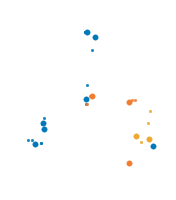
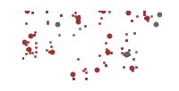

# Data Science Testing

[Eric J. Ma](https://ericmjl.github.io/)

PyData Ann Arbor

2020-01-15

---

## Get the Slides!


<!-- .element: style="width: 300px; text-align: center" -->

<small>https://ericmjl.github.io/testing-for-data-scientists/</small>

---

## About Me

<table>
    <tr>
        <td width="33%" style="text-align: center; border-width: 0; vertical-align: bottom">
            
        </td>
        <td width="33%" style="text-align: center; border-width: 0; vertical-align: bottom">
            
        </td>
        <td width="33%" style="text-align: center; border-width: 0; vertical-align: bottom">
            
        </td>
    </tr>
    <tr>
        <td>
            <p style="text-align: center">Investigator, Scientific Data Analysis</p>
        </td>
        <td>
            <p style="text-align: center">ScD, Biological Engineering, 2017</p>
        </td>
        <td>
            <p style="text-align: center">Bayesian Stats, ML, Network Science</p>
        </td>
    </tr>
</table>

---

## How many of you are data scientists?

<small>Keep your hands up...</small>

----

## How many of you write code in a programming language >50% of your time?

<small>Keep your hands up...</small>

----

## How many of you write tests for your code?

<small>OK, please put your hands down.</small>
<!-- .element: class="fragment" -->

----

## For those who don't write tests, what are your reasons?

----

## For those who do write tests, what are your reasons?

---

## Today's Main Point

If you build data products as a data scientist,
investing time in writing tests today will:
<!-- .element: style="text-align:left" -->

- save you time later on,
<!-- .element: class="fragment" -->
- thus decreasing team frustration,
<!-- .element: class="fragment" -->
- and increasing team productivity.
<!-- .element: class="fragment" -->

<small style="text-align: center">The same holds for basic software engineering skills in general.</small>
<!-- .element: class="fragment" -->

---

## Two Stories

1. How automated testing revealed weakspots
<!-- .element: class="fragment" -->
2. How testing accelerated our data analysis workflow
<!-- .element: class="fragment" -->

---

## How automated testing revealed weakspots

----

### HIV Drug Resistance Prediction

<div>
`MAKVLENPALEO` $\rightarrow$ 1.34
</div>
<!-- .element: class="fragment" -->
<div>
`MADVLENPALEO` $\rightarrow$ 150

`MADVLENPALRO` $\rightarrow$ 39.3
</div>
<!-- .element: class="fragment" -->

----

### Model Training Functions

```python
# utils.py

def read_protein(filename):
	sequence = ... # stuff happens
    return sequence

# Returns array 5 times the length of sequence.
def featurize(sequence):
    features = ... # stuff happens
    return features

# Return model predictions.
def predict(features):
    model = ... # load scikit-learn model
    return model.predict(features)
```

What have we assumed here
that probably ought to be tested?
<!-- .element: class="fragment" -->

----

### Let's write a test for featurize!

```python
from utils import featurize

def test_featurize():
    sequence = "MKALVIELQDPG..."  # something 99 amino acids long.
    feats = featurize(sequence)

    assert feats.shape[0] == 1
    assert feats.shape[1] == len(sequence) * 5
```

----

### Let's write a test for predict!

<!-- Q&A

Q: How did you decide on just doing an integration test for predict,
but not for featurize?

A: Most of the function calls inside `predict` was well-tested already,
so we don't need to duplicate those test.
Rather, we only wanted to make sure that they worked together,
given certain inputs.
-->

```python
from utils import predict

# An integration test for the predict function.
def test_predict():
    sequence = "MKALVIELQDPG..."  # something 99 amino acids long.
    feats = featurize(sequence)
    preds = predict(feats)
```

Cool! Are we done?

----

### Clearly not!

One **huge** assumption we made here was about the input string.

Let's revisit that test.

<!-- ---- -->

<!-- - Featurize intended before predict. -->
<!-- - Prediction function uses a model that has been trained only on 495-long vectors per sample. -->
<!-- .element: class="fragment" -->
<!-- - Vectors came from 99-letter strings. -->
<!-- .element: class="fragment" -->
<!-- - Those 99-letter strings need to be drawn from a valid alphabet; not all 26 letters are valid. -->
<!-- .element: class="fragment" -->

----

_If a user inputs a string that is not 99 letters long, the program should crash._

----

_If a user inputs a string with invalid characters, the program should crash._

----

Let's make the code more robust.

```python
acceptable_letters = set('ACDEFGHIJKLMNPQRSTVWXY')
def featurize(sequence):
    if not len(sequence) == 99:
        raise ValueError("put informative error here.")
    if not set(sequence).issubset(acceptable_letters):
        raise Exception("put informative error here.")
    features = ... # stuff happens
    return features

```
<!-- .element: class="fragment" -->

----

Let's make the test more robust.

```python
from hypothesis import strategies as st, given
# other imports here...
acceptable_letters = set('ACDEFGHIJKLMNPQRSTVWXY')

@given(
    sequence=st.text(
        alphabet=acceptable_letters,
        min_size=0,
        max_size=200)
    )
)
def test_featurize(sequence):
    if len(sequence) != 99:
        with pytest.raises(ValueError):
            feats = featurize(sequence)
    else:
        feats = featurize(sequence)
        assert feats.shape[0] == 1
        assert feats.shape[1] == len(sequence) * 5
```

<small>_Doing the same for invalid characters is an exercise left for the reader (tm)._</small>
<!-- .element: class="fragment" -->

----

### We are in a much better position

- Function defends against unexpected inputs.
<!-- .element: class="fragment" -->
- Tests help us catch breaking changes.
<!-- .element: class="fragment" -->
- Your engineers are going to thank you.
<!-- .element: class="fragment" -->

----

### In practice...

We caught this issue by using `Hypothesis`, and worked backwards.

_Writing tests helps you catch bugs._
<!-- .element: class="fragment" -->

---

## How testing accelerated our data analysis workflow

----

### Protein engineering platform

- Large but simple codebase.
<!-- .element: class="fragment" -->
- Many independent utilities with some function sharing.
<!-- .element: class="fragment" -->

**Focus on data access.**
<!-- .element: class="fragment" -->

----

### Our data: complex, evolving data management requirements

- As platform gets built out, data requirements change.
<!-- .element: class="fragment" -->
- New enzyme = similar schema.
<!-- .element: class="fragment" -->
- The database is as far normalized as possible
<!-- .element: class="fragment" -->

Lots of joins needed to make get data in human-readable form.
<!-- .element: class="fragment" style="text-align:left" -->

----

### We used to have to update Postgres views...

<a href="https://imgflip.com/i/3m8mhk"></a>

----

### ...until we switched to caching our views as dataframes.


----

### The schema is the data's API!

<small>_Actually, data access APIs might sometimes be better..._</small>

<small class="fragment">_...but that's another story_</small>

----

### If the schema changes even slightly...

----

### ...we want to know ASAP.

----
### Tests for Data

- Column names
<!-- .element: class="fragment" -->
- Column data types
<!-- .element: class="fragment" -->
- Nullity
<!-- .element: class="fragment" -->
- Bounds
<!-- .element: class="fragment" -->
- ...more?
<!-- .element: class="fragment" -->

----

### Example of Testing Data

```python
def test_query_function():
    data = query_function()

    # Column tests:
    expected_columns = [...]
    assert set(expected_columns) == set(data.columns)

    # Null checks: this column __must__ be fully populated
    assert pd.isnull(df[column_name]).sum() == 0
```

----

### Test-accelerated workflow

Because of data caching and data testing...
<!-- .element: class="fragment" -->

...a non-routine data query that may have taken half a day to get right...
<!-- .element: class="fragment" -->

<div class="fragment" >
...instead took 10 minutes to finish and be confident in.

<small style="color: gray">(repeat this N times for new analyses)</small>
</div>

---

## How to build a regular practice of testing in data science

----

### Be <span style="color:green">`#UNBOSSED`</span>

- Make opinionated CI configuration templates.
<!-- .element: class="fragment" -->
- Push DevOps team for guidance.
<!-- .element: class="fragment" -->

----

### <span style="color:green">`#AUTOMATE`</span> everything

- Set up a CI system that mandates checks on code.
<!-- .element: class="fragment" -->
- Don't allow code to be merged without review passing tests.
<!-- .element: class="fragment" -->

<small>Nobody argues against convenience!</small>

----

### Build <span style="color:green">`#CREDIBILITY`</span>

- Provide testimonials to your DevOps team (where applicable).
<!-- .element: class="fragment" -->
- Deliver talks about testing!
<!-- .element: class="fragment" -->

---

## Conclusions

- If you depend on <span style="color: red">code</span>, write tests for it.
- If you depend on <span style="color: red">data</span>, write tests for it.

If you depend on it, write a test for it.
---

## Resources

- [Essays on Data Science](https://ericmjl.github.io/essays-on-data-science/)
- [Personal Blog](https://ericmjl.github.io/blog/)
- [Data Science Manifesto](http://www.datasciencemanifesto.org/)
- [Great Expectations](https://greatexpectations.io/)
- [Hypothesis](https://hypothesis.readthedocs.io/)
- [`pytest`](https://pytest.readthedocs.io/)

---

## Have fun testing!
